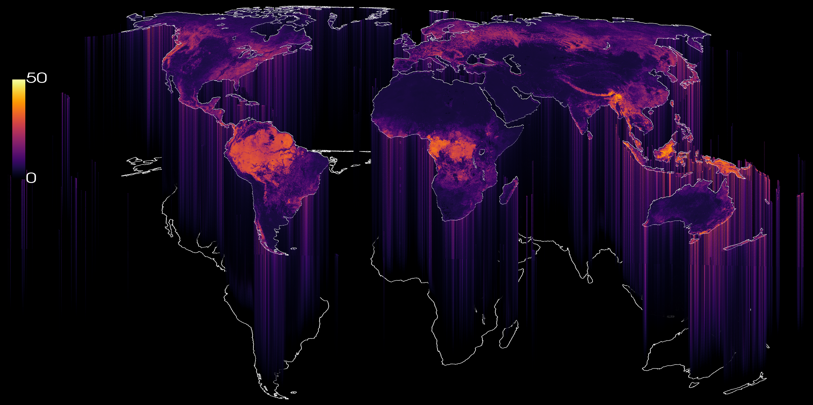

# VSM: A Vertical Vegetation Structure Model of the Earth


<p align="center">
  <a href="https://huizhml.github.io/map-explorer/">
    
  </a>
</p>

🗺️ **Explore the maps: [huizhml.github.io/map-explorer](https://huizhml.github.io/map-explorer/)**

To better support carbon and biodiversity monitoring and to support the SDGs, EUDR, and 30x30, we have developed a global vertical vegetation structure model (VSM) to describe the full 3D-structure of vegetation at high spatial resolution. It’s a follow-up based on our prior work, but now we go beyond "just" canopy top height.

**VSM** is a global dataset that maps vertical vegetation structure at 10 m resolution. While existing products typically describe vegetation using canopy top height or other single-value metrics, VSM provides the **full vertical profile** through relative-height (RH) metrics, with predictive quantiles to characterize uncertainty. The dataset is based on a deep learning model trained on Sentinel-2 imagery and 178 million spatially sparse height profiles from NASA’s GEDI spaceborne lidar mission.


This repository contains the code to produce, evaluate, and publish VSM. That includes data download, model training, prediction on every Sentinel-2 MGRS tile worldwide, and postprocessing. VSM is distributed as Cloud Optimized GeoTIFFs for 2020 and 2024, about 360 TB per year.


## Getting started

### Environment

There is no pinned `requirements.txt`. The main dependencies are:

- **Modelling:** `torch`, `lightning`, `jsonargparse`, `kornia`, `timm`, `ffcv`, `wandb`, `onnxruntime-gpu`
- **Geospatial:** `gdal`, `rasterio`, `rio-cogeo`, `geopandas`, `dask-geopandas`, `xarray`, `stackstac`, `pystac`, `planetary-computer`, `earthengine-api`
- **Data / compute:** `dask`, `dask-jobqueue`, `h5py`, `zarr`, `pyarrow`, `numpy`, `pandas`, `scipy`, `scikit-learn`
- **Config / plotting:** `hydra-core`, `omegaconf`, `matplotlib`, `seaborn`, `contextily`

GDAL, rasterio, and opencv are easiest to install from conda-forge. The LUMI environment scripts are in [scripts/lumi/](scripts/lumi/) (`env_create.sh`, `env_cnr.yml`).

The conformal prediction package is installed separately:

```bash
pip install -e ./src-cp
```

We recommend installing [`just`](https://github.com/casey/just) (>= 1.27). All Hydra entrypoints are exposed as `just` recipes.

### Credentials

Earth Engine service-account keys go in `keys/` (git-ignored). Cloud upload credentials (Source Coop, CloudFerro, LUMI-O, ERDA) are read from the environment or rclone/AWS config, never from the repository.

## Running things

Each step is a plain Python function or class, registered as a Hydra op in a YAML file under `config/<section>/config.yaml`. You run it by name through that package's `run` module:

```bash
python -m <package>.run run=<op_name> [run.<field>=<value> ...]
```

The [justfile](justfile) wraps every op. Recipe names are prefixed by package, so tab completion narrows the list:

```bash
just                         # list all recipes, grouped
just dl-<TAB>                # download recipes
just viz-datacube run.bg_color=white run.rh_step=4    # extra args are Hydra overrides
```

| Package | Entrypoint | Config | `just` prefix |
|---|---|---|---|
| `download/` | `python -m download.run` | [config/download/config.yaml](config/download/config.yaml) | `dl-` |
| `preprocessing/` | `python -m preprocessing.run` | [config/preprocessing/config.yaml](config/preprocessing/config.yaml) | `pre-` |
| `postprocessing/` | `python -m postprocessing.run` | [config/postprocessing/config.yaml](config/postprocessing/config.yaml) | `post-` |
| `evaluation/` | `python -m evaluation.<module>` (one per file) | [config/eval/config.yaml](config/eval/config.yaml) | `eval-` |
| `visualization/` | `python -m visualization.run` | [config/viz/config.yaml](config/viz/config.yaml) | `viz-` |
| `tools/` | `python -m tools.run` | [config/tools/config.yaml](config/tools/config.yaml) | `tools-` |
| `deploy/` | `python -m deploy.run` | [config/deploy/config.yaml](config/deploy/config.yaml) | none |

If an op's config sets `save_dir`, [config/runner.py](config/runner.py) adds a symlink to it under `root_results_dir/<section>/<op>`. All results can then be browsed in one place while the data stays where it is. Ops that write raw products set `link_results: false` to skip this.

### Adding a new op

1. Write a function (or class) in the relevant package. Do not use `argparse`; take arguments as keyword parameters.
2. Register it in that package's `config/<section>/config.yaml`:
   ```yaml
   my_op:
     _target_: tools.my_module.my_function
     target_type: function      # or: class (+ target_method, func_args)
     save_dir: ~/data/gvs/results/my_op
     some_param: 42
   ```
3. Optionally, add a `just` recipe in the matching group of the [justfile](justfile).

## Pipeline

### 1. Download: [download/](download/)

Builds the MGRS tile grid and fetches training and inference inputs: GEDI L2A shots (with slope and sensitivity filtering), Sentinel-2 scene selection and download, DEM, growing-season aggregates, ForestTemp, and state-of-the-art canopy-height maps for comparison. Downloads run through Google Earth Engine or Planetary Computer.

```bash
just dl-get-mgrs
just dl-all-valid-gedi
just dl-s2-best-candidates && just dl-s2-download
just dl-sota-chms
```

### 2. Preprocessing: [preprocessing/](preprocessing/)

The training-set build in [preprocessing/pipeline/](preprocessing/pipeline/) runs in numbered steps: `step1_generate_index_table` → `step2_train_test_split` → `step3_merge_h5s` → `step4_convert_to_beton` (FFCV) → `step5_calculate_stats`. It also computes the input statistics for the naturalness task and converts zarr to h5.

### 3. Training and prediction: [run.py](run.py)

[run.py](run.py) is a `LightningCLI` app with the subcommands `fit`, `validate`, `test`, and `predict`. Configs are in [config/](config/) (`train.yaml`, `predict.yaml`, `deploy.yaml`, `qat.yaml`, `train_naturalness.yaml`). Backbones are in [config/model/](config/model/).

```bash
python run.py fit     -c config/train.yaml   --model.backbone config/model/xception_mix_order.yaml
python run.py predict -c config/predict.yaml --model.backbone config/model/xception_mix_order.yaml --data.init_args.tile_id=32MQE
```

- [models/](models/): `VSRegression` (the main RH-profile regressor), the naturalness classifier, backbones in `modules/`, and losses in `losses/` (quantile CE, pinball, Gaussian NLL, etc.)
- [datasets/](datasets/): FFCV data module for training, and zarr datasets for tile-wise inference and downstream tasks
- [callbacks/](callbacks/): prediction and GeoTIFF writers, metric and uncertainty loggers, QAT export

[run.sh](run.sh) has ready-made SLURM invocations for each mode.

### 4. Postprocessing: [postprocessing/](postprocessing/)

Converts raw tile predictions into the published product:

- bias correction and blending across tile borders ([postprocessing/corrections/](postprocessing/corrections/))
- masking of snow and water, COG translation, VRTs, and distance maps
- STAC collection creation and updates
- extraction of sparse predictions at GEDI shots, and tile bookkeeping (nodata, redundant, or re-blend tiles)

### 5. Evaluation: [evaluation/](evaluation/)

Each module has its own entrypoint and its own section in [config/eval/config.yaml](config/eval/config.yaml).

| Module | What it evaluates |
|---|---|
| `on_gedi` | VSM against held-out GEDI RH metrics |
| `on_sota_chm` | canopy height against SOTA CHMs, with Wilcoxon tests and bootstrap CIs |
| `on_als`, `on_lvis`, `lvis_vs_gedi`, `forest_mask` | against airborne lidar (ALS, LVIS) on stable-forest pairs |
| `structure_partial_correlation` | whether lower RHs carry information beyond RH98 |
| `diversity_maps`, `on_diversity_indices`, `on_wsci` | structural diversity indices and WSCI |
| `on_naturalness`, `on_glcm_texture` | downstream naturalness classification |
| `protected_area_analysis` | RH-profile AUC inside and outside protected areas, per biome |
| `significance` | shared statistical tests |

Conformal prediction calibration of the quantile intervals is a separate package, [src-cp/](src-cp/). See [src-cp/README.md](src-cp/README.md) and run `python scripts/cp/run_cp.py --config_path config/cp/extended-config.yaml`.

### 6. Visualization: [visualization/](visualization/)

Global mosaics and PDF atlases (RH bands and prediction intervals), 3-D datacube renders, vertical-profile plots, and diagnostic PDFs. Exploratory notebooks are in [visualization/notebooks/](visualization/notebooks/).

```bash
just viz-global-mosaic-pdf-rh98
just viz-datacube-eu
```

### 7. Deploy and distribution: [deploy/](deploy/)

Uploads, benchmarks, and moves the COG products on Source Coop (`python -m deploy.run run=sc_upload|sc_bench|sc_move`), plus helpers for GEE, Planetary Computer, ERDA, and prediction-status checks. Dataset metadata for the open-data listing is in [config/products/vsm.yaml](config/products/vsm.yaml).

- Public catalog: `https://data.source.coop/geoai-ucph/gvsm/`

## Tools and scripts

- [tools/](tools/): standalone utilities, all registered in [config/tools/config.yaml](config/tools/config.yaml). They cover parquet column merging, STAC retargeting and COG audits, world grids, LaTeX table generation, and the understory and sub-canopy analyses.
- [analysis/](analysis/): ad-hoc analysis scripts.
- [scripts/](scripts/): shell wrappers for HPC and data transfer.
  - [scripts/hendrix/](scripts/hendrix/): SLURM launchers for the Hendrix cluster (`run_eval.sh`, `run_postprocessing.sh`, `run_visualization.sh`, ...), plus GEDI and LVIS downloads and LUMI-O copies
  - [scripts/lumi/](scripts/lumi/): LUMI job allocation, environment setup, and correction runs
  - [scripts/core/](scripts/core/): shared helpers for rclone sync, Source Coop and CloudFerro uploads, and COG translation

## Repository layout

```text
.
├── run.py              # LightningCLI: fit / validate / test / predict
├── justfile            # one recipe per Hydra op
├── config/             # Hydra op configs (per section) + LightningCLI configs
├── download/           # GEDI, Sentinel-2, DEM, SOTA CHM, MGRS grid
├── preprocessing/      # training-set build pipeline (index → split → h5 → beton → stats)
├── datasets/           # FFCV / zarr / h5 datasets and transforms
├── models/             # VSRegression, naturalness model, backbones, losses
├── callbacks/          # Lightning callbacks (writers, loggers, QAT export)
├── postprocessing/     # bias correction, blending, COG/VRT, STAC, sampling
├── evaluation/         # evaluation against GEDI, lidar, SOTA CHMs, downstream tasks
├── visualization/      # mosaics, datacubes, profiles, notebooks
├── deploy/             # Source Coop / GEE / MSPC / ERDA publishing
├── tools/              # standalone utilities
├── analysis/           # ad-hoc analyses
├── src-cp/             # conformal prediction package (pip install -e)
└── scripts/            # SLURM + data-transfer shell scripts (Hendrix, LUMI)
```

## Contact

huzh@di.ku.dk, nila@di.ku.dk, igel@di.ku.dk (University of Copenhagen)

Data license: [CC BY 4.0](https://creativecommons.org/licenses/by/4.0/)
